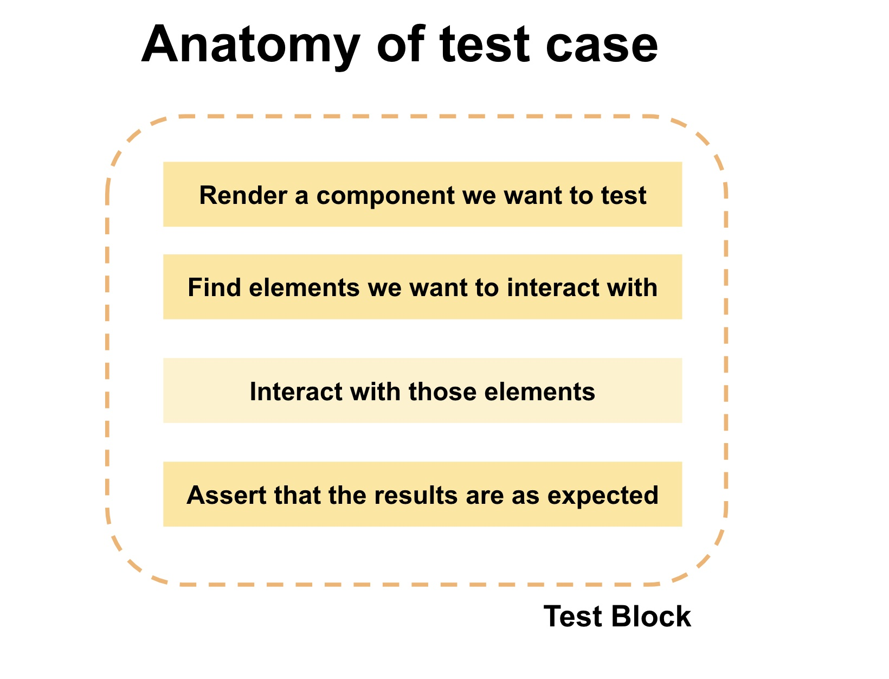
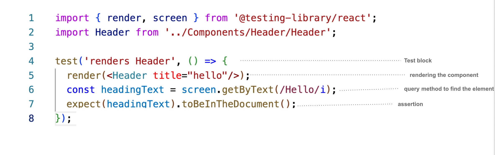
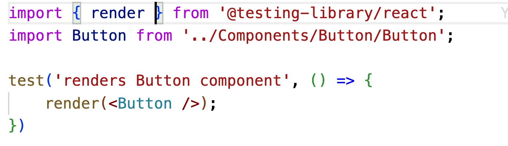

# 👩🏽‍💻 ReactJS TDD Workshop

Check my online workshops [here](Workshop.md).

Feel free to follow me over [Twitter](https://twitter.com/hellonehha)

## How to run test?

`npm run test`

This will also generate coverage

## How to run the project?

`npm run start`

## Coverage

`npm run test --coverage`

## ❓ What is TDD?

TDD means test driven development. In TDD we write the test-cases first and then write the code to make them pass. 

TDD is a prefer way of writing the test-cases in the projects. 

## Why to write Test-cases

1. Avoid bugs: Lot of bugs caught when the test-cases are written. Anytime a new feature is get added or a bug got fixed, test-cases helps to validate if rest of the code-base is safe from it.

2. Confidence: Test-cases helps in gaining confidence on their code-base.

3. Write 'accessible' code: React Testing Library force devs to write accessible JSX.

4. Base of documentation: Test-cases can act as the documentation and helps new joiners to understand what is happening in the code-base.

5. Quality code: Good test-cases force developers to write quality code.

## Type of testing?

1) Manual testing

2) Unit Testing

3) Integration Testing

4) End-to-End Testing

## What we will be doing in this repo?

We will be learning (implemented) unit testing. We are using React Testing Library (RTL) to write the test-cases.

## Tech-stack

1. ReactJS (used Create-react-app)

2. Typescript (for type checking)

3. React Testing Library (the default testing library comes with Create React App)

## Resources

[React Testing Library](https://testing-library.com/docs/react-testing-library/intro/)

## Test-cases Anatomy

## Organize Test-cases

1. Describe: To organize your test-cases we put our test-cases within `describe`. This known as `test-suite`.

2. test/it: To write the test-case we can either use `test()` or `it()`.

3. todo: To write the todo test-cases we use `test.todo()`

4. skip: To skip any test-case we use `test.skip()`

## How does it look in code?

## Deep dive

We are using Jest and React-testing-library which comes default with create-react-app. If you want to install it then here are the commands:

`npm install --save-dev @testing-library/react`

### Why React-Testing-Library?

React Testing Library is using dom-testing utitlity. It provides an easy and friendly way to test the code. It has query methods which helps the users to write test-case in an easy way.

The prinicipal of the React-testing-libray is "Write test cases the way your users will use the software".

It means you don't need to go in all nitty-gritty but focus only on how user is going to use the software or application. Eg: for your user it doesn't matter how the API request is happening and where but what the user would be interested in data.So, your priority should be testing the data rather than getting into detail testing the API.

[React testing Library](https://testing-library.com/)

### Query Methods

React Testing Library provides query method which is a way to query the elements in the document. There are 3 ways one can query:

1. getBy*

2. queryBy*

3. findBy*

The difference between `get`, `query`, and `find` is what it returns when there is no matching result.

`getBy*`: When there is no match found it will return a descriptive error.

`queryBy*`: When there is no match found it will return  NULL.

`findBy*`: It returns Promise. When there is no match found then Promise will be rejected or if more than one element is found after a default timeout of 1000ms.

#### Using Query Methods

There are multiple query methods available to query the elements from the DOM. Eg. `getByRole`, `getByText`. If there are multiple elements then we can use `getAllByRole`, `getAllByText`.

## Testing Scenario

**1. Testing the component is render**

The first step for doing the unit testing is to make sure the component is rendering.
In `RTL`, we have `render` method. This is different from the `Enzayme`.

So, we have to import the render from `RTL` and then all we need to do is just use `render()`.

Under the hood, `RTL` create a div (container) and append it to the `document.body` and this is where the `component` will be rendered.

>> If you will create your own custom container then it won't work.

**2. Testing the JSX of component (HTML tags)**

**3. Testing the content**

**4. Testing the attributes**

**5. Testing the events**

**6. Snapshot testing**

Snapshot testing takes the snapshot of the component and matches everytime. If there would be any change the test will be fail and flag. Goal is to have snapshot at every release.

Once you will run the `test` commands, a `snapshot` folder will be created and will store all the snapshots of the components for which the snapshot test code is written.

There are 2 ways through which one can do snapshot testing:

1. *react-test-renderer*

[Example](https://github.com/Neha/pesto-tdd-workshop/blob/master/src/test/Header.test.js)

2. *RTL snapshot*

[Example](https://github.com/Neha/pesto-tdd-workshop/blob/master/src/test/Button.test.js)

**What is the difference between the both approach?**

In snapshot testing, we can either test the HTML DOM or Virtual DOM. With `react-test-renderer ` we get the virtual DOM snapshot and with `react Testing Library` we get the HTML DOM snapshot.

**Which DOM to test?**

For unit, integration, and snapshot test virtual DOM. Reason is these tests are focused towards the React output rather than the HTML output.

**7. Tesitng Props**

**8. Testing API content**

